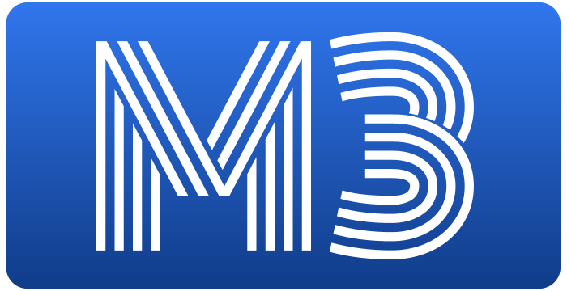

# M3
M3 is an open solana protocol for the next version of NFT marketplace trading.
Currently we support cNFT core trading functions.

# IDL
- [IDL - m3.json](./src/idl/m3.json)
- [Types - m3.ts](./src/types/m3.ts)

# License
Apache 2.0
